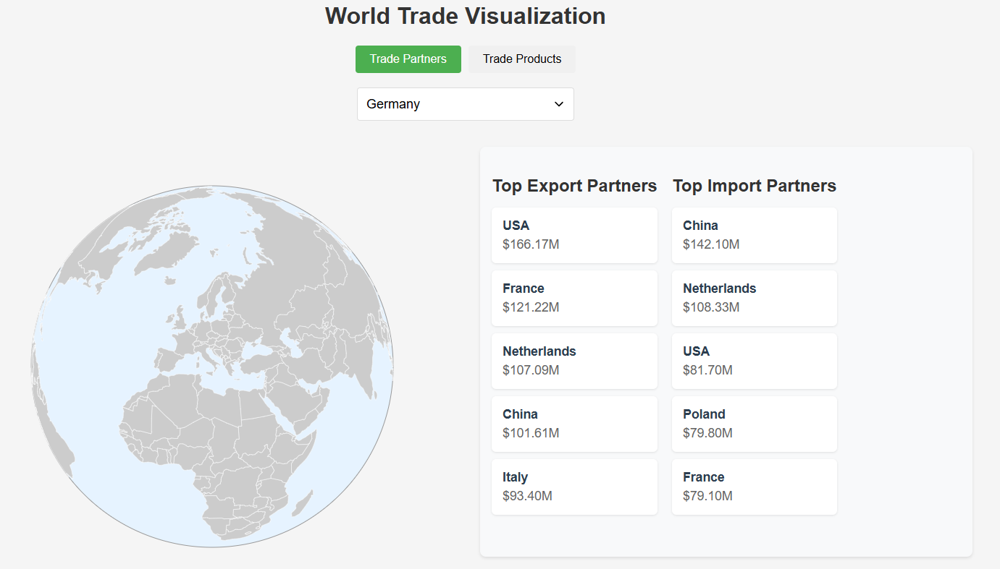

# World Trade Visualization

An interactive visualization of world trade data, showing trade relationships and product flows between countries.


## Features

- Interactive 3D globe visualization with rotation and country selection
- Detailed trade partner analysis showing top export and import relationships
- Product trade data visualization with categorized imports and exports
- Real-time data updates and interactive country selection
- Responsive design with synchronized globe views

## Local Development

### Prerequisites

- Python 3.9 or higher
- Git
- pip (Python package installer)

### Setup Instructions

1. Clone the repository:
   ```bash
   git clone https://github.com/YOUR_USERNAME/Visualization_of_World_Trade.git
   cd Visualization_of_World_Trade
   ```

2. Create a virtual environment (recommended):
   ```bash
   # On Windows
   python -m venv venv
   .\venv\Scripts\activate

   # On macOS/Linux
   python3 -m venv venv
   source venv/bin/activate
   ```

3. Install dependencies:
   ```bash
   pip install -r requirements.txt
   ```

4. Run the Flask application:
   ```bash
   python app.py
   ```

5. Open your browser and navigate to `http://localhost:5000`

### Using the Application

1. **Select a Country**: Use the dropdown menu or click directly on the globe to select a country
2. **View Trade Partners**: The "Trade Partners" view shows:
   - Top export partners with trade volumes
   - Top import partners with trade volumes
   - Interactive globe highlighting trade relationships

3. **View Trade Products**: Switch to "Trade Products" to see:
   - Major export categories and volumes
   - Major import categories and volumes
   - Product-specific trade flows

4. **Interact with the Globe**:
   - Click and drag to rotate
   - Click on countries to select them
   - Both globes stay synchronized in rotation


## Data Sources

- Country , exports, imports and names from [BACI database](https://www.cepii.fr/CEPII/en/bdd_modele/bdd_modele_item.asp?id=37) 
- World map data from Natural Earth

## Technologies Used

- Flask (Python backend)
- D3.js (Visualization)
- Pandas (Data processing)
- HTML/CSS/JavaScript (Frontend)

## Project Structure

```
Visualization_of_World_Trade/
├── app/
│   ├── static/
│   │   ├── css/
│   │   ├── js/
│   │   └── data/
│   └── templates/
├── data/
│   ├── country_codes_V202501.csv
│   ├── top_exports_by_country_aggregated.csv
│   └── top_imports_by_country_aggregated.csv
├── requirements.txt
└── app.py
```